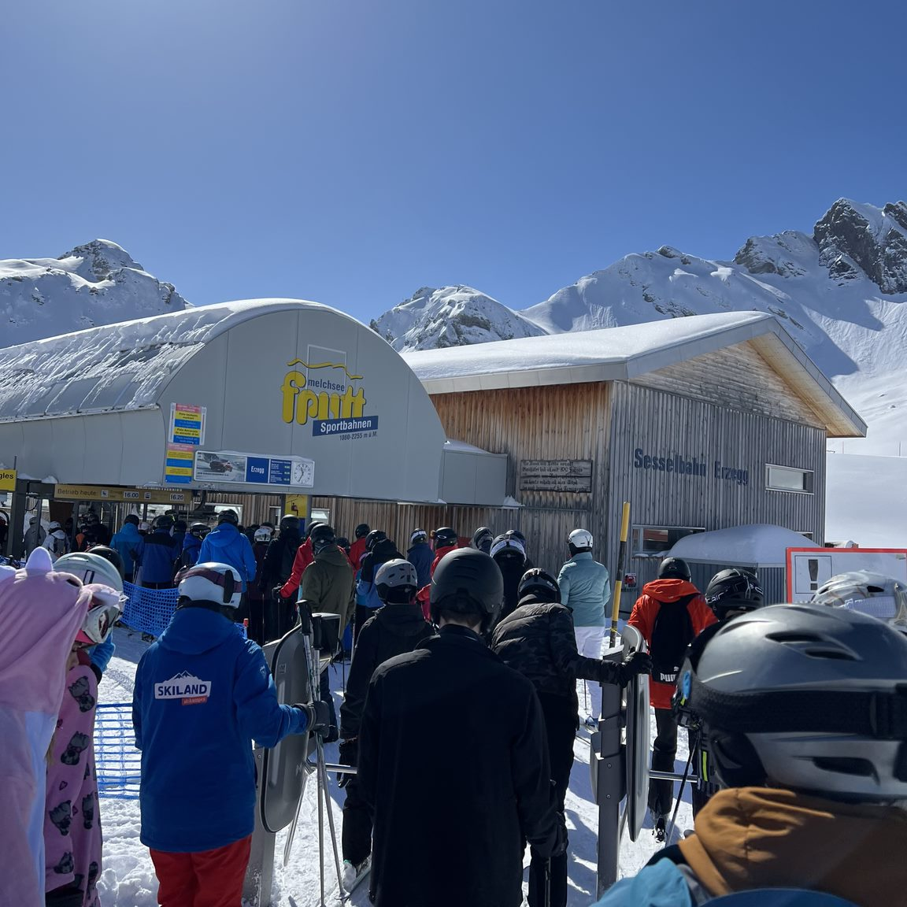
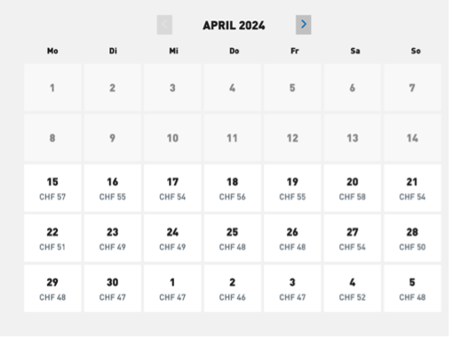

+++
title = "Dynamic Pricing-Oder wie preiswert ist der Schnee"
date = "2024-04-28"
draft = false
pinned = false
tags = []
image = "lenk-werbung.png"
description = "Dynamic Pricing in aller Munde. Über die Pro- und Kontraseiten dieser Preisstrategie im Interview mit zwei Unternehmen. Was sind Sie bereit an einem verregneten Tag fürs ski fahren zu bezahlen. ?  "
+++
Dynamic Pricing in aller Munde. Über die Pro- und Kontraseiten dieser Preisstrategie im Interview mit zwei Unternehmen. Was sind Sie bereit an einem verregneten Tag fürs ski fahren zu bezahlen. ?  

Eine Reportage von Anouk Brandenberg und Lisa von Siebenthal 25. April 2024

Donnerstagvormittag, ich sehne mich nach dem Neuschnee und dem wundervollen Bergpanorama welches ich geniessen könnte, währenddessen ich den Hang hinuntersause. Stattdessen rühre ich mich kein Stück, umgeben von Leuten, welche sich entweder an mir vorbei drängeln wollen oder von hinten auf meine Ski fahren. Vor und hinter mir stehen eine Menge von Leuten, welche es alle eilig haben, vom Sessellift wieder in die Höhe transportiert zu werden. Die Bergbahn Melchsee-Frutt läuft auf Hochtouren, die Leute werden dadurch aber nicht weniger. Ich frage mich, wie es wohl in den Nachbarskigebieten aussieht an einem solch schönen Tag an dem alle auf die Piste wollen. Oder noch spezifischer, wie sieht es in den Gebieten aus, welche bewusst mit hohen Preisen Besuchern fernhalten wollen? Sprichwort: Dynamic Pricing.

### Dynamic Pricing

> ist eine Strategie, welche Unternehmen anwenden, um die Preise ihre Produkte oder Dienstleistungen basierend auf Umfragen anzupassen. Ein Modell berechnet die Preise aufgrund Algorithmen, sprich die KI ist bei einem solchen preis Modell stets am Werk. Faktoren wie Angebot und Nachfrage, externe Faktoren wie Wetter oder Zeit, Preisgestaltung der Konkurrenz und Verhaltenswissenschaft werden miteinbezogen. Es ist kein neues Modell, sondern wird bereits seit längerem in bspw. in der Hotellerie und der Flugindustrie angewendet. Seit neustem taucht es auch schon in der Gastronomie auf (bspw. *Nobelhart & Schmutzig,* D-Berlin). In der Hotellerie und der Flugindustrie kennen wir alle die Last-Minute-Angebote, wo die Preise für Bucher in letzter Minute tief sind, um Plätze im Flugzeug oder im Hotel zu füllen. Ein weiteres Ziel dieses Modells, es will möglichst früh dem Kunden die Tickets verkaufen, dass ist vor allem bei den Bergbahnen der Fall.

#### **Dynamic Pricing in der Kritik**

In den Medien wird Dynamic Pricing auch oftmals kritisiert. Die NZZ berichtete über misstrauische Kunden, SRF betonte die Kritik des Konsumentenschutzes und in der Kommentarfunktion von “20 Minuten” äusserte sich die Mehrheit der Nutzer negativ über dieses Preismodell. Seit dieser Wintersaison wendet auch Adelboden-Lenk Dynamic Pricing an. Mit dem Motto «Wer früher bucht, bucht am besten» lancierten sie ein dynamisches Preismodell und werben seither dafür. Ihrem Motto muss recht gegeben werden. Je früher Tickets gebucht werden, desto günstiger sind die Preise. Aber ein sonniger Samstag mit Neuschnee ist drei Wochen zuvor noch nicht vorhersehbar. Somit übernehmen die Kunden mit diesem Preismodell das Schlechtwetterrisiko. Wir lassen zwei Unternehmen mit unterschiedlicher Strategie, einmal ohne und einmal mit Dynamic Pricing, zu Wort kommen. Was sind ihre Beweggründe. 

## Melchsee-Frutt mit traditionellem Preismodell

Im Interview mit Daniel Dommann, Geschäftsführer Melchsee-Frutt, stellt sich heraus, dass er sich schon länger mit dem Thema Dynamic Pricing auseinandersetzt. “...für eine professionelle Geschäftsführung hat man sich mit dem Produkt auseinander zu setzten” so Dommann. Die Produkte des Bergbahngebietes Melchsee-Frutt sind vielfältig. Im Winter sind dies Transport- und Schneesportanlagen, die Pisten und die Schlittenbahnen. Im Sommer erfreuen sich die Kunden an Erlebnis-, Biker- und Wanderwegen und ein Erlebnisspielplatz für die kleinsten Kunden. Für Daniel Dommann ist klar, wenn man ein Geschäft hat, muss man sich auch immer wieder über die Weiterentwicklung der Produkte und Dienstleistungen sowie deren Preise unterhalten. "Wir wollen, wir müssen Geld verdienen”, sagt er. Da die Bergbahn Melchsee-Frutt der Korporation von Kernz gehört, muss sie sich durch die erwirtschafteten Erlöse selbst finanzieren.

> ### Korporationen
>
> Korporationen sind historische Vorläufer von modernen Organisationen. Das Wort Korporation stammt vom lateinischen *corpus* "Körper". Es gibt verschiedene Korporationsarten, im Berufswesen, im Studentenwesen oder eben auch Korporationen als Nutzungs-genossenschaften. In der Schweiz werden auch Korporationen für Wald-, Flur-, Weide- und ähnliche Nutzungs-genossenschaften als Korporationen bezeichnet. In den meisten Kantonen sind sie privatrechtlich organisiert. In einigen wenigen Kantonen können sie aber auch gemeindeähnlich sein. Die Korporation Zug beispielsweise ist eine öffentlich-rechtliche Gemeinde und funktioniert wie eine Genossenschaft, hat rund 4300 Korporationsbürger aus den 36 Korporations-Geschlechter, darf keine Steuern erheben, im Gegenteil, die Korporation ist selber steuerpflichtig.

## Auch die Bergbahnen haben steigende Kosten

Ein gutes Beispiel für die Sportbahnen mussten im letzten Jahr CHF 350’000 Stromkosten bezahlt werden. Durch die Energiekrise sind es mittlerweile schon CHF 540’000.00 nur um die Anlage betreiben zu können. 
Das Thema Preis und Geld ist ein permanentes Management-Thema, “...und da gibt es gute Argumente für Dynamic Pricing, es gibt aber auch Argumente dagegen”, so Dommann. Sie haben vor rund fünf Jahren mit einer speziellen Halbtageskarte etwas ausprobiert. Man bezahlte morgens den Preis für eine Ganztageskarte und wenn diese vor 12:30 Uhr zurückgebracht wurde, wurde die Differenz zu der Halbtageskarte zurückerstattet. Dieses Modell war jedoch sehr umständlich für und daraus entwickelten sie ein neues Produkt, die “3-Stunden-Karte". Sie aktiviert sich beim ersten Benutzen und geniesst grosse Beliebtheit. 
Hat die Bergbahn Melchsee-Frutt nicht das Gefühl, mit dem Strom mitschwimmen zu müssen und auf Dynamic Pricing umzusteigen? “Die Frage stellen wir uns tatsächlich auch» antwortet uns Daniel Dommann. Ein Hauptgrund, warum das Unternehmen bisher auf Dynamic Pricing verzichtet hat, ist die Bettenanzahl im Skigebiet selbst. Diese ist sehr tief, sodass die Kundschaft gemäss Aussage von Daniel Dommann ca. 80 % Tagesgästen besteht. «Der Tagesgast ist auf Spontanität angewiesen und entscheidet oftmals am Morgen, je nach Wetter, ob er zum Skilaufen gehen möchte oder nicht», erklärt er.

Die Bergbahn Melchsee-Frutt stellt auch fest, dass sie von naheliegenden Gebieten vermehrt Gäste bekommen. “... an anderen Orten wissen sie erst am Morgen, wenn sie an der Kasse stehen, was der Preis ist”, so Daniel Dommann. Das schafft neue Probleme. Parkplätze und Transportmöglichkeiten sind begrenzt und stossen irgendwann mal an ihre Grenzen. Und Daniel Dommann ergänzt “... das Schlimmste wäre, wir müssten Gäste nach Hause schicken”. Die Preisgestaltung wird demnach auch hier jeden Winter neu lanciert.

## «Skifahren ist ein Luxusgut»

Skifahren ist auch eine Preisfrage. Durch die teilweise noch höheren Preise, werden Automatisch Leute ausgeschlossen. Diese welche sich an schönen Tage die Tageskarte für 100 Franken nicht leisten wollen oder können. Wird das Skifahren in Zukunft nur etwas für die Reichen sein?  Diese Frage stellen wir auch Daniel Dommann: “...Skilaufen ist ein Luxusgut. Das war vor 50 Jahren schon ein Luxusgut”. 

Das Ticket ist beim Skifahren jedoch oft das günstigste. Teuer wird vor allem die Ausrüstung, ebenso muss die Anreise mitgerechnet werden.

Wechseln wir zu dem Unternehmen mit Dynamic Pricing und dem erwähnten Slogan «Wer zuerst bucht, bucht am besten! – zu Adelboden Lenk. Auf Anfrage stellte uns Stefanie Inniger, die Unternehmens-Kommunikatorin der Bergbahn Adelboden-Lenk AG, einen Fragenkatalog zur Verfügung, in welchem sie unsere Fragen zum Thema Dynamic Pricing aus ihrer Geschäftssicht beantwortete.

## «…denn: Wer früh bucht, profitiert von attraktiven Frühbucherrabatten»

Als erstes wollen wir wissen, was der entscheidende Grund war, auf ein dynamisches Preismodell zu wechseln? «Die Skiregion Adelboden - Lenk hat sich seit mehreren Jahren ausführlich mit der Einführung von einem dynamischen Preismodell beschäftigt…» so Stefanie Inniger. Anhand von Umfragen und Gesprächen mit Experten wurde nach einer neuen Preisstrategie gesucht. «Mit der neuen Preisstrategie wollen wir unseren Gästen den bestmöglichen Service bieten, denn: Wer früh bucht, profitiert von attraktiven Frühbucherrabatten,» Auf die Frage, ob das Skifahren durch das Variieren der Preise nicht nur noch exklusiver wird, erhalten wir von Stefanie Inniger eine ähnliche Antwort wie von Daniel Dommann. Nämlich, dass das Skifahren eben teuer ist. Leute beschweren sich über dynamische Skipreise, dem gegenüber herrscht offenbar eine grosse Toleranz in anderen Bereichen, wie z.B. in der Hotellerie. «Skifahren wird nicht «noch exklusiver»-, es ist ganz klar teuer und wird immer teurer werden» sagt auch sie.
Sie begründen ihre dynamischen Preise damit, dass sie auch Gäste abholen wollen, die preissensibler sind. Auch sie betont nochmals, dass es klar ist, dass Skifahren zu den teureren Sportarten gehört. Wie auch Daniel Dommann schon erläuterte, erklärt uns Stefanie Inniger, dass die Einnahmen für die Betriebskosten benötigt werden. 

## Wie reagiert die Kundschaft darauf

Nach unseren Recherchen berichtet die Presse ähnlich einem allgemeinen Entsetzen der Kunden. Und auch Adelboden - Lenk hat Rückmeldungen und Telefonate von Gästen erhalten, die ihr Unverständnis ausdrückten, erklärt uns Stefanie Inniger.
Mit den Bemühungen, das Wissen zu vermitteln, wie das gewählte Preismodell mit den Frühbucher-Rabatten funktioniert, versucht Adelboden – Lenk Transparenz gegenüber ihren Kunden zu schaffen. Mit der Kundenempfehlung, dass sie 3-4 Tage im Voraus buchen sollen, wenn das Wetter schon bekannt ist, unterstützen sie ihre Kunden zusätzlich. «Wer dann bucht, hat im Vergleich zum Tagespreis noch immer einen grossen Rabatt», so Stefanie Inniger. 

Auch Künstliche Intelligenz spielt eine zentrale Rolle bei Dynamic Pricing. Was sagt Stefanie Inniger dazu? «KI ist allgegenwärtig und es gibt sicher spannende Anwendungsgebiete …Wo der Weg aber hinführt, ist wie ein Blick in die Glaskugel und daher nicht zielführend. Wir verfolgen die Entwicklung aber gespannt».
Die Skiregion Adelboden-Lenk ist nicht das einzige Skigebiet, welche die Preise der Skitageskarten je nach Anfrage anpasst. In Zermatt, Gstaad oder Davos wird auch schon mit dynamischen Preisen gearbeitet.
Einen weiteren Vorteil von Dynamic Pricing sei, dass das dynamische Preismodell auch helfen kann, Gästeströme zu lenken und damit einen Überlauf von Pisten zu verhindern, so Stefanie Inniger. Genau das, was Daniel Dommann ebenso beobachtet. Nur, dass die Ströme dann zuweilen nicht ganz von den Skipisten verschwinden, sondern zu denen abwandern, die noch kein Dynamic Pricing eingeführt haben. 

Also – wie preiswert ist der Schnee wirklich?